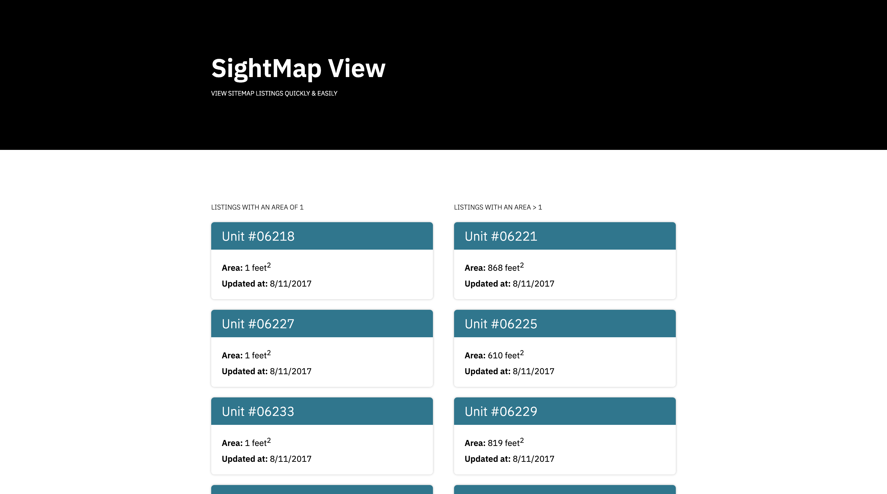

# SightMap Viewer

This simple PHP application allows you to view SightMap the SightMap multifamily
units index. There are two columns: one for units with an area of `1` and one for
units with an area of `>1`.



## Development

To develop, just spin up a local server and be sure you're watching for Sass changes
with:

```
sass --watch ./main.scss:./main.css
```

### Deployment

Just upload the contents of this repo to your hosting provider of choice and
you're golden!

:heart:
